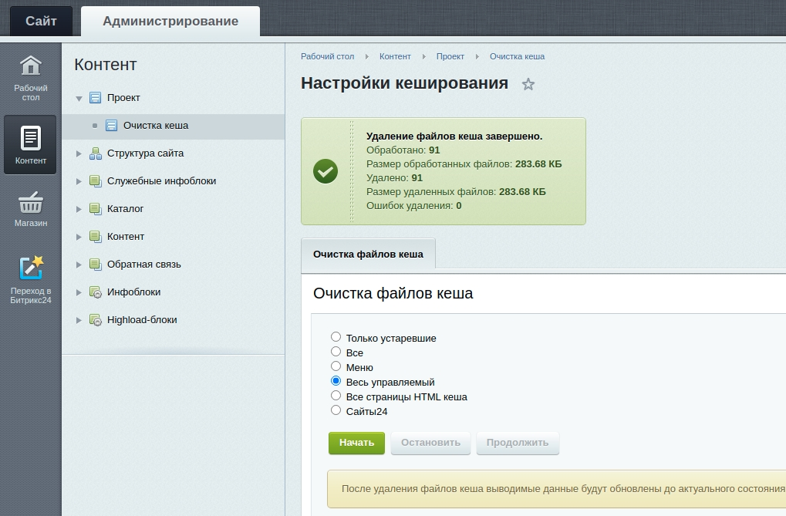

Удаление кеша
===============

Инструмент очистки файлов кеша пользователями, не входящими в группу Администраторы

## Введение

В CMS Битрикс есть проблема со сбросом кеша, если ты контент-менеджер, а не администратор сайта. В этом случае штатная
страница настроек кеширования не доступна. А это очень важный момент при редактировании контента. При загрузке страницы
из кеша, контент-редактор не видит изменения. Данный инструмент предназначен для удаления файлов кеша пользователям любой
заданной группы.

## Возможности

* Быстрая интеграция функционала на любой сайт
* Указание групп доступа пользователей для которых необходимо выводить страницу очистки кеша

## Внедрение

1. Добавить страницу /bitrix/admin/custom_cache.php.
2. Исключить эту страницу из игнорирования Git (см. файл .gitignore). Это позволит в будущем при обновлении ядра Битрикс
   быстро восстановить админ.страницу.
3. Добавить страницу /local/admin/custom_cache.php.
   Это непосредственно админ.страница для очистки кеша. Она разработана на основе штатной страницы.
4. Добавить обработчик события построения административного меню OnBuildGlobalMenu.
   Для этого нужно код обработчика /local/php_interface/classes/Handlers/Menu/AdminMenu.php подключить в библиотеке
   классов. В init.php подключить файл /local/php_interface/include/eventHandlers.php. Если такой уже имеется,
   добавить в него обработчик. Это необходимо для добавления в административное меню пункта перехода на страницу очистки
   кеша.
5. Добавить сервис проверки доступа. Для этого нужно код сервиса /local/php_interface/classes/Services/UserAccess.php
   подключить в библиотеке классов. Зарегистрировать сервис проверки доступа (см. файл /local/php_interface/config.php).
6. В файле /local/php_interface/classes/Services/UserAccess.php:12 указать ID группы Контент-редакторов.

## Результат

В результате Контент-редактор получает возможность удалять файлы кеша
