Удаление кеша
===============

Инструмент очистки файлов кеша пользователями, не входящими в группу Администраторы

## Введение

В CMS Битрикс есть проблема со сбросом кеша, если ты контент-менеджер, а не администратор сайта. В этом случае штатная
страница настроек кеширования не доступна. А это очень важный момент при редактировании контента. При загрузке страницы
из кеша, контент-редактор не видит изменения. Данный инструмент предназначен для удаления файлов кеша пользователям любой
заданной группы.

## Возможности

* Быстрая интеграция функционала на любой сайт
* Указание групп доступа пользователей для которых необходимо выводить страницу очистки кеша

## Получение файлов решения
Для получения файлов решения необходимо клонировать репозиторий на локальную установку или загрузить архив. Структура
файлов и папок повторяет структуру файлов и папок на сайте.
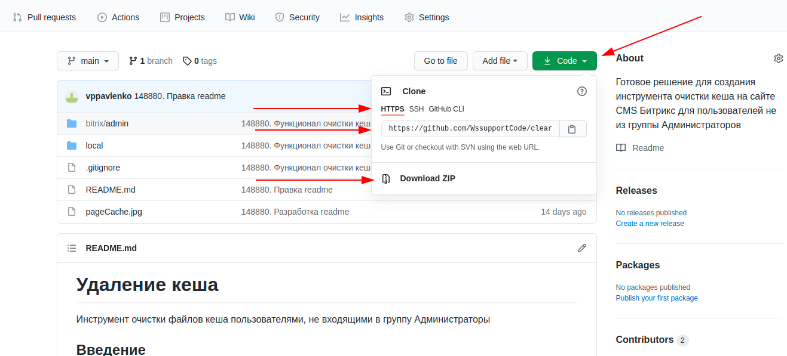

## Внедрение

1. В папку /bitrix/admin/ добавить страницу /bitrix/admin/custom_cache.php, в которой подключается кастомная админ.
   страница сброса кеша.
   
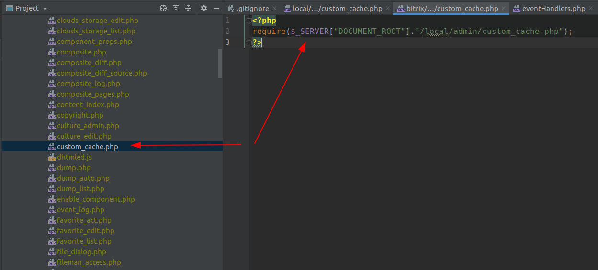
   
2. Исключить эту страницу из игнорирования Git (см. файл .gitignore).
   Это позволит в будущем при обновлении ядра Битрикс быстро восстановить админ.страницу.
   
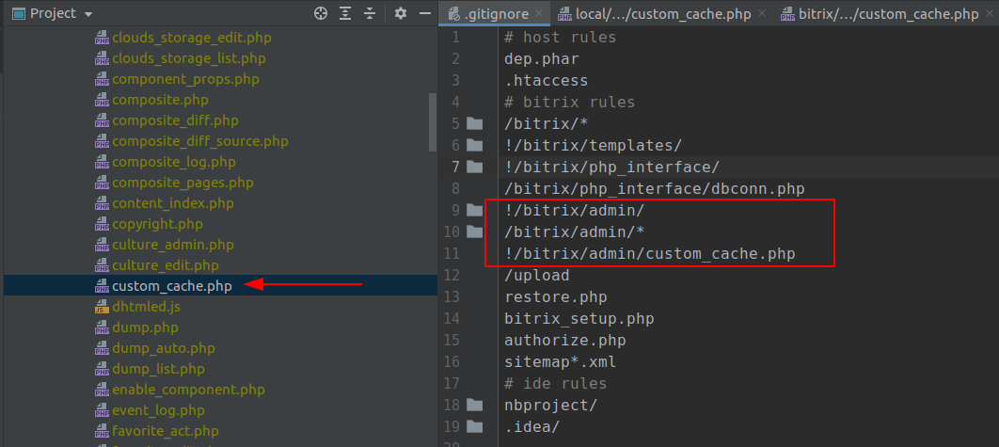
   
3. В папку /local/admin/ (если такой нет, то создать) добавить страницу /local/admin/custom_cache.php.
   Это непосредственно админ.страница для очистки кеша. Она разработана на основе штатной страницы.
   
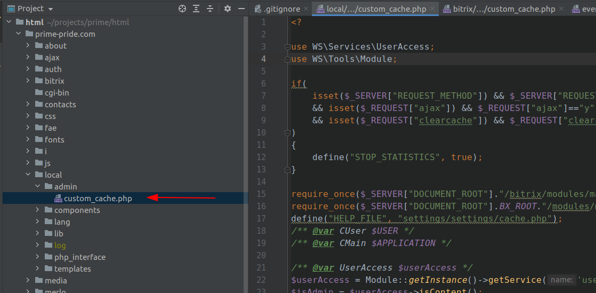   

4. Для вывода кастомного пункта административного меню со ссылкой на страницу очистки кеша необходимо создать обработчик
   события построения административного меню OnBuildGlobalMenu.
   Для этого нужно код обработчика /local/php_interface/classes/Handlers/Menu/AdminMenu.php подключить в библиотеке
   классов.
   
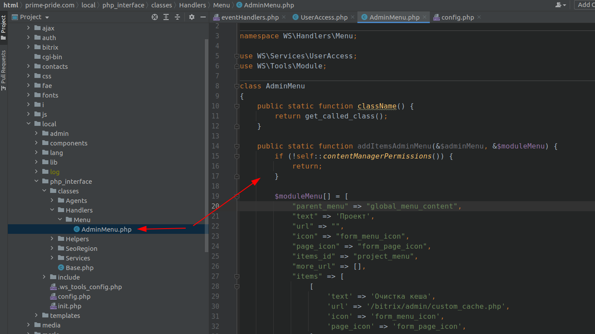
   
   После чего обработчик нужно зарегистрировать. Для этого в папку /local/php_interface/include/ добавить файл
   /local/php_interface/include/eventHandlers.php

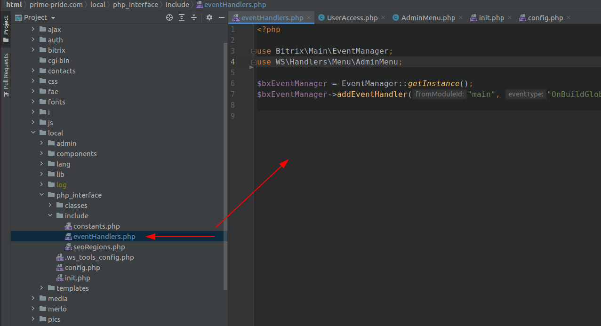

   и подключить его в init.php

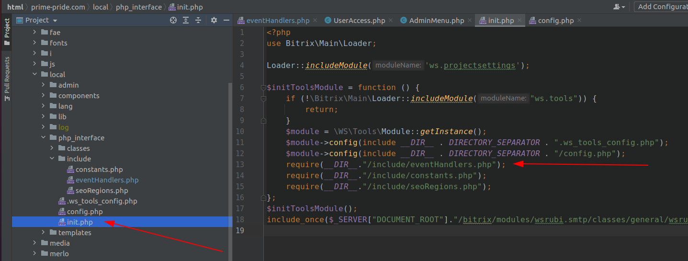   
   
   Если файл eventHandlers.php на проекте уже имеется, добавить в него код регистрации обработчика из файла
   /local/php_interface/include/eventHandlers.php

5. Для организации доступа к странице очистки кеша необходимо создать сервис проверки доступа.
   Для этого нужно код сервиса /local/php_interface/classes/Services/UserAccess.php
   подключить в библиотеке классов.
   
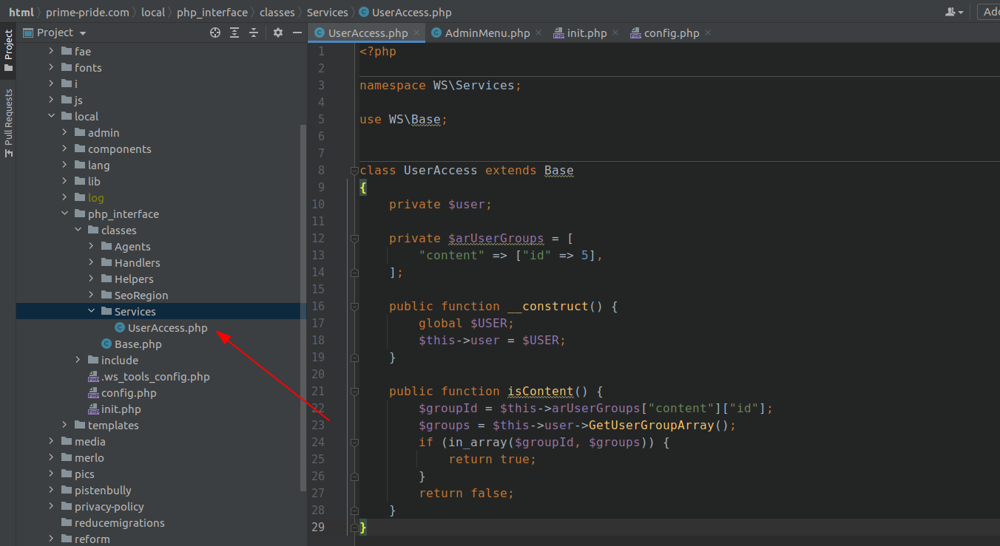

   Зарегистрировать сервис проверки доступа. Для этого в папку /local/php_interface/ добавить файл /local/php_interface/config.php).

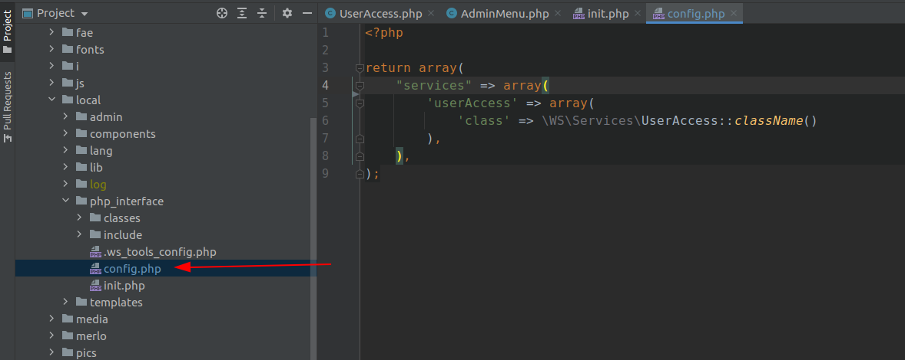

   и подключить его в init.php

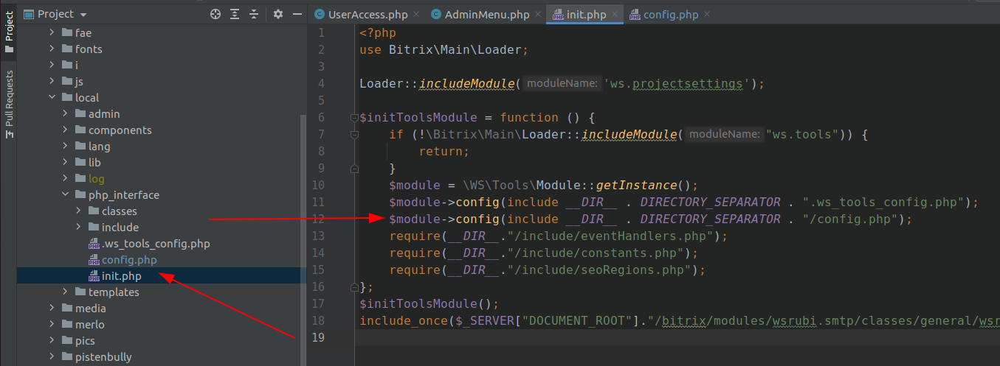

   Если файл config.php на проекте уже имеется, добавить в него код регистрации сервиса из файла
   /local/php_interface/config.php

6. В файле /local/php_interface/classes/Services/UserAccess.php:12 указать ID группы Контент-редакторов.

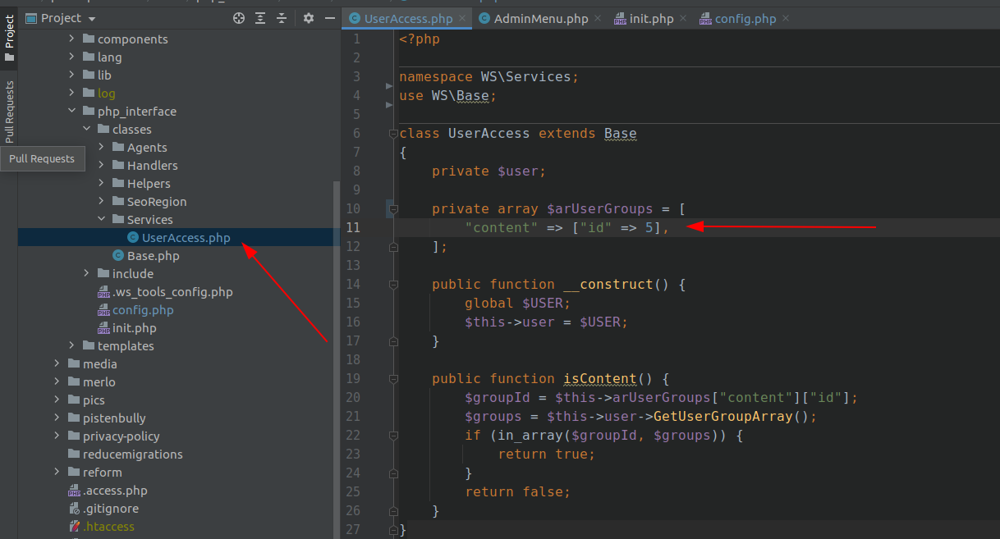

## Результат

В результате Контент-редактор получает возможность удалять файлы кеша

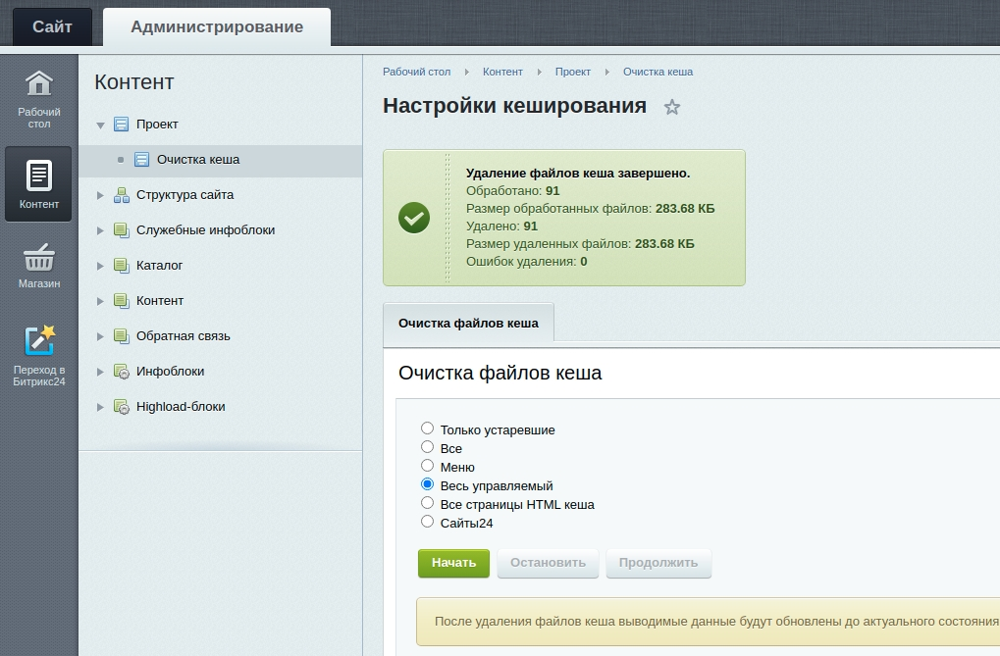